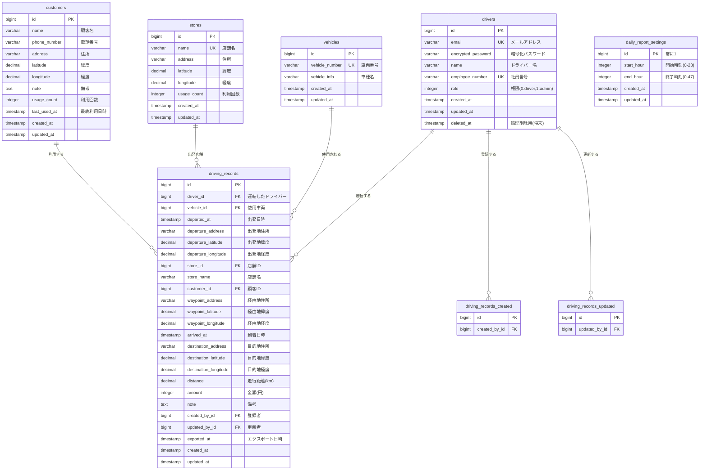

# データベース設計書

## ER図



## テーブル定義詳細

### 1. drivers（ドライバー管理）

| カラム名 | 型 | 制約 | 説明 |
|---------|-----|------|------|
| id | BIGSERIAL | PRIMARY KEY | 主キー |
| email | VARCHAR(255) | NOT NULL, UNIQUE | メールアドレス（devise認証用） |
| encrypted_password | VARCHAR(255) | NOT NULL | 暗号化パスワード（devise） |
| name | VARCHAR(100) | NOT NULL | ドライバー名 |
| employee_number | VARCHAR(50) | UNIQUE | 社員番号（任意） |
| role | INTEGER | NOT NULL, DEFAULT 0 | 権限（0: driver, 1: admin） |
| created_at | TIMESTAMP | NOT NULL | 作成日時 |
| updated_at | TIMESTAMP | NOT NULL | 更新日時 |
| deleted_at | TIMESTAMP | NULL | 削除日時（論理削除用、将来対応） |

**制約：**
```sql
CONSTRAINT check_role CHECK (role IN (0, 1))
CONSTRAINT check_email_format CHECK (email ~* '^[A-Za-z0-9._%+-]+@[A-Za-z0-9.-]+\.[A-Z|a-z]{2,}$')
```

**インデックス：**
```sql
CREATE INDEX idx_drivers_email ON drivers(email);
CREATE INDEX idx_drivers_deleted_at ON drivers(deleted_at);
```

---

### 2. vehicles（車両管理）

| カラム名 | 型 | 制約 | 説明 |
|---------|-----|------|------|
| id | BIGSERIAL | PRIMARY KEY | 主キー |
| vehicle_number | VARCHAR(50) | NOT NULL, UNIQUE | 車両番号 |
| vehicle_info | VARCHAR(100) | NULL | 車種名（例：プリウス） |
| created_at | TIMESTAMP | NOT NULL | 作成日時 |
| updated_at | TIMESTAMP | NOT NULL | 更新日時 |

**制約：**
```sql
CONSTRAINT check_vehicle_number_not_empty CHECK (LENGTH(TRIM(vehicle_number)) > 0)
```

**インデックス：**
```sql
CREATE INDEX idx_vehicles_vehicle_number ON vehicles(vehicle_number);
```

---

### 3. stores（店舗登録）

| カラム名 | 型 | 制約 | 説明 |
|---------|-----|------|------|
| id | BIGSERIAL | PRIMARY KEY | 主キー |
| name | VARCHAR(100) | NOT NULL, UNIQUE | 店舗名 |
| address | VARCHAR(255) | NOT NULL | 住所 |
| latitude | DECIMAL(10,6) | NULL | 緯度 |
| longitude | DECIMAL(10,6) | NULL | 経度 |
| usage_count | INTEGER | DEFAULT 0 | 使用回数（よく使う店舗の判定用） |
| created_at | TIMESTAMP | NOT NULL | 作成日時 |
| updated_at | TIMESTAMP | NOT NULL | 更新日時 |

**制約：**
```sql
CONSTRAINT check_name_not_empty CHECK (LENGTH(TRIM(name)) > 0)
CONSTRAINT check_usage_count_positive CHECK (usage_count >= 0)
CONSTRAINT check_latitude_range CHECK (latitude >= -90 AND latitude <= 90)
CONSTRAINT check_longitude_range CHECK (longitude >= -180 AND longitude <= 180)
```

**インデックス：**
```sql
CREATE INDEX idx_stores_name ON stores(name);
CREATE INDEX idx_stores_usage_count ON stores(usage_count DESC);
```

---

### 4. customers（顧客管理）

| カラム名 | 型 | 制約 | 説明 |
|---------|-----|------|------|
| id | BIGSERIAL | PRIMARY KEY | 主キー |
| name | VARCHAR(100) | NOT NULL | 顧客名 |
| phone_number | VARCHAR(20) | NULL | 電話番号 |
| address | VARCHAR(255) | NOT NULL | 住所 |
| latitude | DECIMAL(10,6) | NULL | 緯度 |
| longitude | DECIMAL(10,6) | NULL | 経度 |
| note | TEXT | NULL | 備考（配慮事項、目印など） |
| usage_count | INTEGER | DEFAULT 0 | 利用回数 |
| last_used_at | TIMESTAMP | NULL | 最終利用日時 |
| created_at | TIMESTAMP | NOT NULL | 作成日時 |
| updated_at | TIMESTAMP | NOT NULL | 更新日時 |

**制約：**
```sql
CONSTRAINT check_name_not_empty CHECK (LENGTH(TRIM(name)) > 0)
CONSTRAINT check_usage_count_positive CHECK (usage_count >= 0)
CONSTRAINT check_latitude_range CHECK (latitude >= -90 AND latitude <= 90)
CONSTRAINT check_longitude_range CHECK (longitude >= -180 AND longitude <= 180)
```

**インデックス：**
```sql
CREATE INDEX idx_customers_name ON customers(name);
CREATE INDEX idx_customers_phone_number ON customers(phone_number);
CREATE INDEX idx_customers_usage_count ON customers(usage_count DESC);
CREATE INDEX idx_customers_last_used_at ON customers(last_used_at DESC);
```

---

### 5. driving_records（運転記録）

| カラム名 | 型 | 制約 | 説明 |
|---------|-----|------|------|
| id | BIGSERIAL | PRIMARY KEY | 主キー |
| driver_id | BIGINT | FK, NOT NULL | ドライバーID（運転したドライバー） |
| vehicle_id | BIGINT | FK, NOT NULL | 車両ID |
| departed_at | TIMESTAMP | NOT NULL | 出発日時 |
| departure_address | VARCHAR(255) | NULL | 出発地点（住所） |
| departure_latitude | DECIMAL(10,6) | NULL | 出発地点（緯度） |
| departure_longitude | DECIMAL(10,6) | NULL | 出発地点（経度） |
| store_id | BIGINT | FK, NULL | 店舗ID |
| store_name | VARCHAR(100) | NOT NULL | 店舗名（店舗未登録の場合は手入力） |
| customer_id | BIGINT | FK, NULL | 顧客ID（登録顧客の場合のみ） |
| waypoint_address | VARCHAR(255) | NULL | 経由地（住所） |
| waypoint_latitude | DECIMAL(10,6) | NULL | 経由地（緯度） |
| waypoint_longitude | DECIMAL(10,6) | NULL | 経由地（経度） |
| arrived_at | TIMESTAMP | NOT NULL | 到着日時 |
| destination_address | VARCHAR(255) | NOT NULL | 目的地（住所） |
| destination_latitude | DECIMAL(10,6) | NULL | 目的地（緯度） |
| destination_longitude | DECIMAL(10,6) | NULL | 目的地（経度） |
| distance | DECIMAL(8,2) | NOT NULL | 走行距離（km） |
| amount | INTEGER | NOT NULL | 金額（円） |
| note | TEXT | NULL | 備考 |
| created_by_id | BIGINT | FK, NOT NULL | 登録者ID |
| updated_by_id | BIGINT | FK, NULL | 更新者ID |
| exported_at | TIMESTAMP | NULL | CSVエクスポート日時（将来対応） |
| created_at | TIMESTAMP | NOT NULL | 作成日時 |
| updated_at | TIMESTAMP | NOT NULL | 更新日時 |

**外部キー：**
```sql
FOREIGN KEY (driver_id) REFERENCES drivers(id) ON DELETE RESTRICT ON UPDATE CASCADE
FOREIGN KEY (vehicle_id) REFERENCES vehicles(id) ON DELETE RESTRICT ON UPDATE CASCADE
FOREIGN KEY (store_id) REFERENCES stores(id) ON DELETE SET NULL ON UPDATE CASCADE
FOREIGN KEY (customer_id) REFERENCES customers(id) ON DELETE SET NULL ON UPDATE CASCADE
FOREIGN KEY (created_by_id) REFERENCES drivers(id) ON DELETE RESTRICT ON UPDATE CASCADE
FOREIGN KEY (updated_by_id) REFERENCES drivers(id) ON DELETE SET NULL ON UPDATE CASCADE
```

**制約：**
```sql
CONSTRAINT check_departed_before_arrived CHECK (departed_at < arrived_at)
CONSTRAINT check_distance_positive CHECK (distance > 0)
CONSTRAINT check_amount_positive CHECK (amount > 0)
CONSTRAINT check_latitude_range CHECK (
  (departure_latitude IS NULL OR (departure_latitude >= -90 AND departure_latitude <= 90)) AND
  (waypoint_latitude IS NULL OR (waypoint_latitude >= -90 AND waypoint_latitude <= 90)) AND
  (destination_latitude IS NULL OR (destination_latitude >= -90 AND destination_latitude <= 90))
)
CONSTRAINT check_longitude_range CHECK (
  (departure_longitude IS NULL OR (departure_longitude >= -180 AND departure_longitude <= 180)) AND
  (waypoint_longitude IS NULL OR (waypoint_longitude >= -180 AND waypoint_longitude <= 180)) AND
  (destination_longitude IS NULL OR (destination_longitude >= -180 AND destination_longitude <= 180))
)
```

**インデックス：**
```sql
CREATE INDEX idx_driving_records_driver_id ON driving_records(driver_id);
CREATE INDEX idx_driving_records_vehicle_id ON driving_records(vehicle_id);
CREATE INDEX idx_driving_records_store_id ON driving_records(store_id);
CREATE INDEX idx_driving_records_customer_id ON driving_records(customer_id);
CREATE INDEX idx_driving_records_departed_at ON driving_records(departed_at DESC);
CREATE INDEX idx_driving_records_arrived_at ON driving_records(arrived_at DESC);
CREATE INDEX idx_driving_records_created_by_id ON driving_records(created_by_id);
CREATE INDEX idx_driving_records_date_vehicle ON driving_records(departed_at, vehicle_id);
```

---

### 6. daily_report_settings（日報範囲設定）

| カラム名 | 型 | 制約 | 説明 |
|---------|-----|------|------|
| id | BIGSERIAL | PRIMARY KEY | 主キー（常に1） |
| start_hour | INTEGER | NOT NULL, DEFAULT 19 | 開始時刻（0-23） |
| end_hour | INTEGER | NOT NULL, DEFAULT 28 | 終了時刻（0-47、翌日対応） |
| created_at | TIMESTAMP | NOT NULL | 作成日時 |
| updated_at | TIMESTAMP | NOT NULL | 更新日時 |

**制約：**
```sql
CONSTRAINT check_start_hour_range CHECK (start_hour >= 0 AND start_hour <= 23)
CONSTRAINT check_end_hour_range CHECK (end_hour >= 0 AND end_hour <= 47)
CONSTRAINT check_singleton CHECK (id = 1)
```

**注意：**
- このテーブルは常に1レコードのみ（シングルトン）
- seeds.rbで初期データを作成

---

## リレーションシップ

### driving_records の外部キー

| 外部キー | 参照先 | ON DELETE | ON UPDATE | 説明 |
|---------|--------|-----------|-----------|------|
| driver_id | drivers(id) | RESTRICT | CASCADE | 運転したドライバー（削除不可） |
| vehicle_id | vehicles(id) | RESTRICT | CASCADE | 使用車両（削除不可） |
| store_id | stores(id) | SET NULL | CASCADE | 店舗（削除されたらNULL） |
| customer_id | customers(id) | SET NULL | CASCADE | 顧客（削除されたらNULL） |
| created_by_id | drivers(id) | RESTRICT | CASCADE | 登録者（削除不可） |
| updated_by_id | drivers(id) | SET NULL | CASCADE | 更新者（削除されたらNULL） |

---

## インデックス戦略

### 検索頻度の高いクエリに対するインデックス

1. **日報検索（日付範囲 + 車両）**
   - `idx_driving_records_date_vehicle(departed_at, vehicle_id)` - 複合インデックス

2. **ドライバー別検索**
   - `idx_driving_records_driver_id(driver_id)`

3. **顧客利用履歴**
   - `idx_driving_records_customer_id(customer_id)`

4. **よく使う店舗・顧客（usage_count降順）**
   - `idx_stores_usage_count(usage_count DESC)`
   - `idx_customers_usage_count(usage_count DESC)`

5. **最近使った顧客**
   - `idx_customers_last_used_at(last_used_at DESC)`

---

## バリデーションルール（Rails側）

### drivers
- `email`: 必須、ユニーク、メール形式
- `password`: 必須、8文字以上（devise）
- `name`: 必須、100文字以内
- `employee_number`: ユニーク（空の場合はスキップ）
- `role`: 必須、0または1

### vehicles
- `vehicle_number`: 必須、ユニーク、空文字不可
- `vehicle_info`: 100文字以内

### stores
- `name`: 必須、ユニーク、空文字不可
- `address`: 必須
- `latitude`: -90〜90の範囲
- `longitude`: -180〜180の範囲
- `usage_count`: 0以上

### customers
- `name`: 必須、空文字不可
- `phone_number`: 20文字以内
- `address`: 必須
- `latitude`: -90〜90の範囲
- `longitude`: -180〜180の範囲
- `usage_count`: 0以上

### driving_records
- `driver_id`: 必須、存在するドライバー
- `vehicle_id`: 必須、存在する車両
- `departed_at`: 必須、日時形式
- `arrived_at`: 必須、日時形式、departed_atより後
- `store_name`: 必須
- `destination_address`: 必須
- `distance`: 必須、0より大きい
- `amount`: 必須、0より大きい
- `created_by_id`: 必須、存在するドライバー

### daily_report_settings
- `start_hour`: 必須、0〜23の範囲
- `end_hour`: 必須、0〜47の範囲

---

## マイグレーション実行順序

1. `drivers`
2. `vehicles`
3. `stores`
4. `customers`
5. `driving_records`（外部キー依存）
6. `daily_report_settings`

---

## Seeds データ

### 初期管理者アカウント
```ruby
Driver.create!(
  email: 'admin@example.com',
  password: 'password',
  name: '管理者',
  role: 1
)
```

### 日報範囲設定
```ruby
DailyReportSetting.create!(
  id: 1,
  start_hour: 19,
  end_hour: 28
)
```

---

## 将来の拡張（フェーズ2）

### audit_logs（監査証跡）
```sql
CREATE TABLE audit_logs (
  id BIGSERIAL PRIMARY KEY,
  auditable_type VARCHAR(50) NOT NULL,
  auditable_id BIGINT NOT NULL,
  action VARCHAR(20) NOT NULL,
  changes JSONB,
  user_id BIGINT NOT NULL REFERENCES drivers(id),
  created_at TIMESTAMP NOT NULL DEFAULT CURRENT_TIMESTAMP
);

CREATE INDEX idx_audit_logs_auditable ON audit_logs(auditable_type, auditable_id);
CREATE INDEX idx_audit_logs_user_id ON audit_logs(user_id);
CREATE INDEX idx_audit_logs_created_at ON audit_logs(created_at DESC);
```
