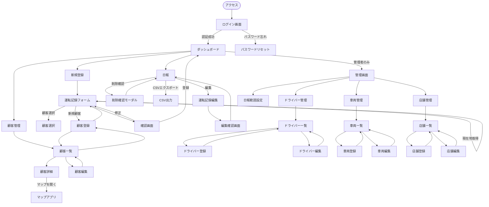
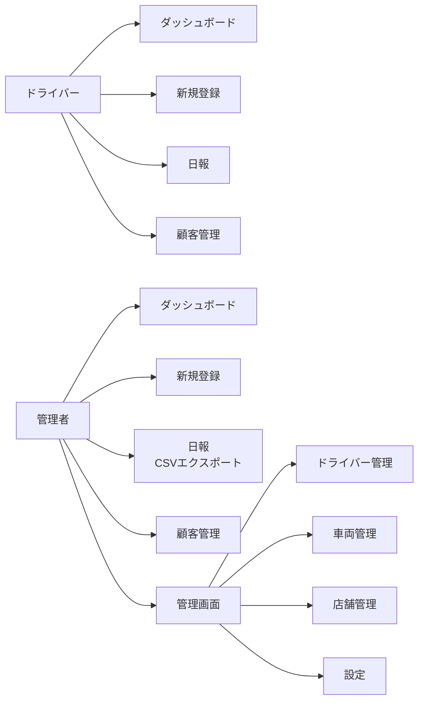

# 画面設計書

## 画面遷移図

### 全体の画面遷移

### 権限別の画面アクセス

---

## 画面一覧

### 1. 認証系

| 画面ID | 画面名 | URL | 権限 | 説明 |
|--------|--------|-----|------|------|
| AUTH-01 | ログイン画面 | `/login` | 未認証 | メール・パスワードでログイン |
| AUTH-02 | パスワードリセット | `/password/reset` | 未認証 | devise標準機能 |

### 2. ドライバー共通画面

| 画面ID | 画面名 | URL | 権限 | 説明 |
|--------|--------|-----|------|------|
| COMMON-01 | ダッシュボード | `/` | 全員 | ホーム画面、最近の運転記録表示 |
| COMMON-02 | 運転記録新規登録 | `/driving_records/new` | 全員 | 運転記録の登録フォーム |
| COMMON-03 | 運転記録確認画面 | `/driving_records/confirm` | 全員 | 登録前の確認画面 |
| COMMON-04 | 日報（運転記録一覧） | `/driving_records` | 全員 | 日付・車両・ドライバーで絞り込み |
| COMMON-05 | 運転記録編集 | `/driving_records/:id/edit` | 全員* | 自分の記録のみ編集可 |
| COMMON-06 | 顧客一覧 | `/customers` | 全員 | 顧客の検索・一覧表示 |
| COMMON-07 | 顧客詳細 | `/customers/:id` | 全員 | 顧客情報・利用履歴表示 |
| COMMON-08 | 顧客登録 | `/customers/new` | 全員 | 新規顧客登録 |
| COMMON-09 | 顧客編集 | `/customers/:id/edit` | 全員* | 顧客情報編集（削除は管理者のみ） |

### 3. 管理者専用画面

| 画面ID | 画面名 | URL | 権限 | 説明 |
|--------|--------|-----|------|------|
| ADMIN-01 | ドライバー一覧 | `/admin/drivers` | 管理者 | ドライバーの一覧・管理 |
| ADMIN-02 | ドライバー登録 | `/admin/drivers/new` | 管理者 | 新規ドライバー登録 |
| ADMIN-03 | ドライバー編集 | `/admin/drivers/:id/edit` | 管理者 | ドライバー情報編集 |
| ADMIN-04 | 車両一覧 | `/admin/vehicles` | 管理者 | 車両の一覧・管理 |
| ADMIN-05 | 車両登録 | `/admin/vehicles/new` | 管理者 | 新規車両登録 |
| ADMIN-06 | 車両編集 | `/admin/vehicles/:id/edit` | 管理者 | 車両情報編集 |
| ADMIN-07 | 店舗一覧 | `/admin/stores` | 管理者 | 店舗の一覧・管理 |
| ADMIN-08 | 店舗登録 | `/admin/stores/new` | 管理者 | 新規店舗登録 |
| ADMIN-09 | 店舗編集 | `/admin/stores/:id/edit` | 管理者 | 店舗情報編集 |
| ADMIN-10 | 日報範囲設定 | `/admin/settings` | 管理者 | 日報の時間範囲設定 |

---

## 画面詳細設計

### AUTH-01: ログイン画面

**URL:** `/login`
**レイアウト:** 認証前レイアウト（ナビゲーションなし）

**表示項目:**
- アプリケーション名
- メールアドレス入力
- パスワード入力
- 「ログイン」ボタン
- 「パスワードを忘れた方」リンク

**動作:**
- ログイン成功 → ダッシュボードへリダイレクト
- ログイン失敗 → エラーメッセージ表示

---

### COMMON-01: ダッシュボード

**URL:** `/`
**権限:** 全ドライバー

**表示項目:**
- ウェルカムメッセージ（「〇〇さん、こんにちは」）
- 本日の統計
  - 今日の運転記録件数
  - 今日の走行距離合計
  - 今日の売上合計
- 最近の運転記録（直近5件）
  - カード形式で表示
  - 各カードに「詳細」「編集」ボタン
- クイックアクション
  - 「新規登録」ボタン（大）
  - 「日報を見る」ボタン
  - 「顧客管理」ボタン

---

### COMMON-02: 運転記録新規登録

**URL:** `/driving_records/new`
**権限:** 全ドライバー

**フォーム項目:**

1. **出発地点（任意）**
   - テキスト入力
   - 「現在地取得」ボタン
   - 取得後は住所を自動入力

2. **店舗名（必須）**
   - ドロップダウン（usage_count降順）
   - 「新規店舗」オプション
   - 選択時は出発地点にも住所を自動入力

3. **顧客名（任意）**
   - ドロップダウン（usage_count降順）
   - 「顧客なし」「新規顧客」オプション
   - 選択時:
     - 目的地に住所を自動入力
     - 「マップを開く」ボタン表示

4. **経由地（任意）**
   - テキスト入力
   - 「現在地取得」ボタン

5. **到着日時（必須）**
   - 日時入力（yyyy/MM/dd HHmm）
   - 「現在時刻」ボタン

6. **目的地（必須）**
   - テキスト入力
   - 「現在地取得」ボタン

7. **走行距離（必須）**
   - 数値入力（小数点2桁まで）
   - 単位表示: km

8. **金額（必須）**
   - 数値入力（整数）
   - 単位表示: 円

9. **車両番号（必須）**
   - ドロップダウン

10. **備考（任意）**
    - テキストエリア

**ボタン:**
- 「確認画面へ」ボタン
- 「キャンセル」ボタン

**バリデーション:**
- リアルタイムバリデーション（Stimulus）
- エラー時は該当フィールドの下に赤文字表示

---

### COMMON-03: 運転記録確認画面

**URL:** `/driving_records/confirm`
**権限:** 全ドライバー

**表示形式:**
- カード形式で入力内容を表示
- 顧客名も表示（アプリ内部用）

**ボタン:**
- 「登録する」ボタン（緑系）
- 「修正する」ボタン（グレー系）

**動作:**
- 「登録する」→ データベースに保存 → ダッシュボードへ
- 「修正する」→ 入力フォームへ戻る（データ保持）

---

### COMMON-04: 日報（運転記録一覧）

**URL:** `/driving_records`
**権限:** 全ドライバー

**絞り込み条件:**
- 日付選択（カレンダーまたはプリセット）
  - プリセット: 当日、昨日、3日前〜1週間前
- 車両選択（ドロップダウン）
- ドライバー選択（管理者のみ、ドロップダウン）
- 「絞り込み」ボタン

**表示形式:**
- **スマホ:** カード形式（縦並び）
- **PC:** テーブル形式

**表示項目:**
- 出発日時
- 出発地点
- 店舗名
- 顧客名（内部表示用）
  - 「マップを開く」リンク（顧客がいる場合）
- 経由地
- 到着日時
- 目的地
- 走行距離
- 金額
- 車両番号
- ドライバー名
- 備考
- 操作ボタン（編集・削除）

**合計行:**
- 走行距離合計
- 金額合計

**CSVエクスポート（管理者のみ）:**
- 「警察署提出用CSV」ボタン
- 「社内管理用CSV」ボタン

---

### COMMON-05: 運転記録編集

**URL:** `/driving_records/:id/edit`
**権限:**
- ドライバー: 自分の記録のみ
- 管理者: 全ての記録

**内容:**
- 新規登録フォームと同じ
- 既存データを表示
- 確認画面を経由して更新

---

### COMMON-06: 顧客一覧

**URL:** `/customers`
**権限:** 全ドライバー

**表示項目:**
- 顧客名
- 電話番号
- 住所
- 利用回数
- 最終利用日

**ソート:**
- デフォルト: usage_count降順

**検索:**
- 顧客名・電話番号・住所で部分一致検索

**各行のボタン:**
- 「詳細」
- 「編集」
- 「削除」（管理者のみ）
- 「マップを開く」

**ページ上部:**
- 「新規顧客登録」ボタン
- 検索フォーム

---

### COMMON-07: 顧客詳細

**URL:** `/customers/:id`
**権限:** 全ドライバー

**表示項目:**
- 顧客名
- 電話番号
- 住所
- 備考
- 利用回数
- 最終利用日

**ボタン:**
- 「マップを開く」ボタン（大きめ）
- 「編集」ボタン
- 「削除」ボタン（管理者のみ）
- 「戻る」ボタン

**利用履歴セクション:**
- この顧客の運転記録一覧（日時降順）
- 各レコードに「詳細」リンク

---

### COMMON-08: 顧客登録

**URL:** `/customers/new`
**権限:** 全ドライバー

**フォーム項目:**
- 顧客名（必須）
- 電話番号（任意）
- 住所（必須）
  - 「現在地取得」ボタン
- 備考（任意）

**ボタン:**
- 「登録する」
- 「キャンセル」

---

### COMMON-09: 顧客編集

**URL:** `/customers/:id/edit`
**権限:** 全ドライバー（削除は管理者のみ）

**内容:**
- 顧客登録と同じフォーム
- 既存データを表示

---

### ADMIN-01〜10: 管理画面

**共通レイアウト:**
- 管理画面用のサイドバー
- 「管理画面」タイトル
- パンくずリスト

**ドライバー管理（ADMIN-01〜03）:**
- 一覧: テーブル形式（名前、メール、権限、アクション）
- 登録・編集: 名前、メール、パスワード、社員番号、権限

**車両管理（ADMIN-04〜06）:**
- 一覧: テーブル形式（車両番号、車種名、アクション）
- 登録・編集: 車両番号、車種名

**店舗管理（ADMIN-07〜09）:**
- 一覧: テーブル形式（店舗名、住所、利用回数、アクション）
- 登録・編集: 店舗名、住所、「現在地取得」ボタン

**日報範囲設定（ADMIN-10）:**
- 開始時刻（0-23の数値入力）
- 終了時刻（0-47の数値入力）
- 「更新する」ボタン

---

## ナビゲーション設計

### ドライバー用ナビゲーション

**スマホ:** ハンバーガーメニュー
**PC:** サイドバー

**メニュー項目:**
- ダッシュボード
- 新規登録
- 日報
- 顧客管理
- ログアウト

### 管理者用ナビゲーション

**メニュー項目:**
- ダッシュボード
- 新規登録
- 日報
- 顧客管理
- **管理** ▼（ドロップダウン）
  - ドライバー管理
  - 車両管理
  - 店舗管理
  - 設定
- ログアウト

---

## レスポンシブ対応

### ブレークポイント
- **sm:** 640px（スマホ横）
- **md:** 768px（タブレット）
- **lg:** 1024px（PC）

### 画面別の対応

| 画面 | スマホ | タブレット | PC |
|-----|--------|-----------|-----|
| ダッシュボード | カード縦並び | カード2列 | カード3列 |
| 日報 | カード縦並び | カード縦並び | テーブル |
| フォーム | 全幅 | 中央寄せ | 中央寄せ |
| 一覧 | カード縦並び | テーブル | テーブル |

---

## UI/UXガイドライン

### カラーテーマ（daisyUI）
- **プライマリ:** 青系（後で決定）
- **セカンダリ:** グレー系
- **成功:** 緑系（登録ボタンなど）
- **警告:** 黄系
- **エラー:** 赤系

### ボタン
- **主要アクション:** `btn-primary`（大きめ）
- **副次アクション:** `btn-secondary`
- **危険な操作:** `btn-error`（削除など）

### フォーム
- **必須項目:** ラベルに `*` マーク
- **エラー表示:** フィールド下に赤文字
- **ヘルプテキスト:** フィールド下にグレー文字

### モーダル
- **確認モーダル:** 削除確認など
- **オーバーレイ:** 半透明の黒背景

---

## アクセシビリティ

- **フォーカス:** キーボード操作でフォーカスが見える
- **ラベル:** 全フォーム要素にラベル付与
- **ARIAラベル:** アイコンボタンにaria-label
- **コントラスト:** WCAG AA準拠

---

## 次のフェーズ

### ワイヤーフレーム作成
- 主要画面（ダッシュボード、新規登録、日報）のワイヤーフレーム
- draw.ioまたはFigmaで作成

### プロトタイプ
- daisyUIのコンポーネントで簡易プロトタイプ
- ユーザーテストの実施
